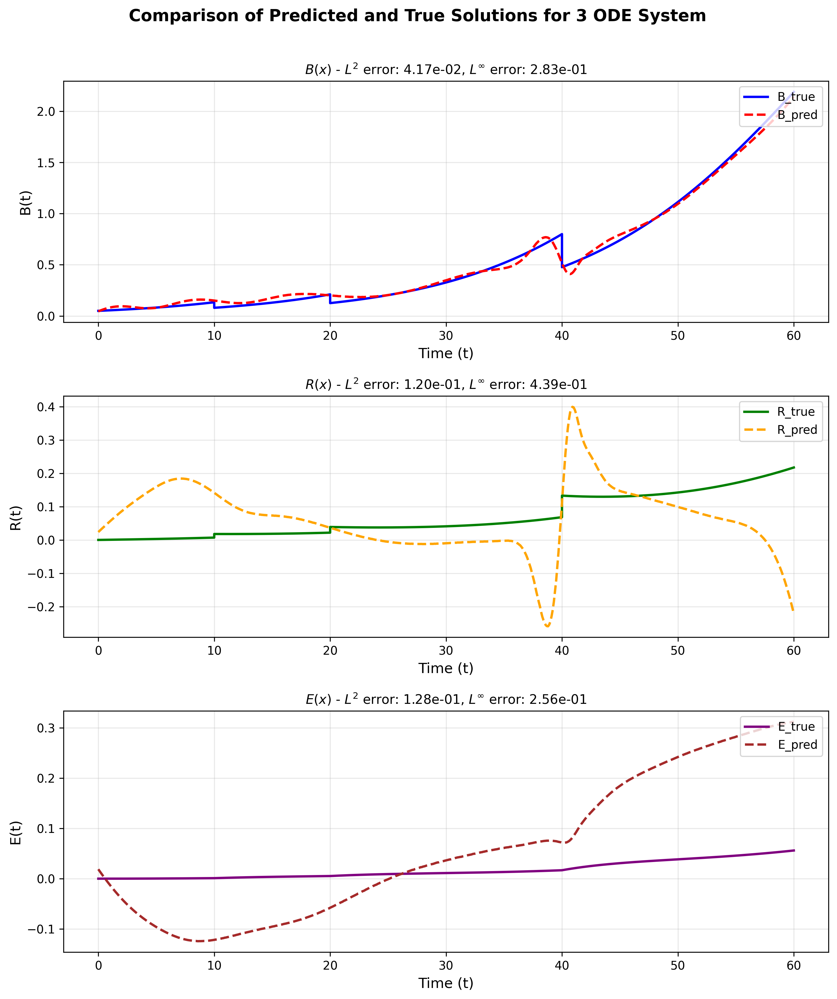

# Loss Strategy Comparison: `loss_switch.py` vs `add_data_loss.py`

## 訓練結果對比

### `add_data_loss.py` - 標準數據驅動方法


### `loss_switch.py` - Jump 加強策略


---

## 核心差異總結

| 特徵 | `add_data_loss.py` | `loss_switch.py` |
|------|-------------------|------------------|
| **Data Loss 策略** | 全時段均勻權重 | 全時段啟用，Jump 附近加強 |
| **ODE Loss 策略** | 全時段均勻權重 | Jump 附近被抑制（凹槽遮罩） |
| **Jump 處理** | 無特殊處理 | 自適應權重切換 |
| **適用場景** | 連續平滑系統 | 跳躍/不連續系統 |

---

## 詳細比較

### 1. **Data Loss 權重策略**

#### `add_data_loss.py`
```python
# 固定權重，全時段相同
lambda_weighting = {
    "B": np.full((len(X_flat), 1), 5.0),
    "R": np.full((len(X_flat), 1), 5.0),
    "E": np.full((len(X_flat), 1), 5.0),
}
```

**特點：**
- ✅ Data loss 在所有時間點權重相同 (λ = 5.0)
- ✅ 簡單直接，適合連續系統
- ⚠️ 對 jump 沒有特殊關注

#### `loss_switch.py`
```python
# 自適應權重，Jump 附近加強
def gaussian_peak(ts, tj, eps, peak_val=2.0):
    """在事件 t_j 附近產生高斯峰，峰值為 peak_val"""
    return 1.0 + (peak_val - 1.0) * np.exp(-((ts - tj) ** 2) / (2.0 * eps ** 2))

w_jump_np = np.ones_like(t_scaled, dtype=np.float64)
for tj in t_js:
    w_jump_np *= gaussian_peak(t_scaled, tj, mask_eps, peak_val=2.0)

lambda_weighting = {
    "B": (5.0 * w_jump_np)[:, None],  # 遠離 jump: 5.0, jump 附近: 10.0
    "R": (5.0 * w_jump_np)[:, None],
    "E": (5.0 * w_jump_np)[:, None],
}
```

**特點：**
- ✅ 非 jump 區域：λ = 5.0（正常）
- ✅ Jump 附近：λ = 10.0（加強 2 倍）
- ✅ 高斯峰平滑過渡，避免突變
- ✅ 專注於 jump 的準確捕捉

---

### 2. **ODE Loss 權重策略**

#### `add_data_loss.py`
```python
# ODE 殘差無遮罩，全時段生效
resB = B.diff(x) - ts * r * B * (1 - B/K)
resR = R.diff(x) - ts * (s0 * B - k12 * R)
resE = E.diff(x) - ts * (k12 * R - kc * E)

# 相對殘差正規化
self.equations = {
    "ode_B": resB / sqrt(B**2 + (eps * B_scale)**2),
    "ode_R": resR / sqrt(R**2 + (eps * R_scale)**2),
    "ode_E": resE / sqrt(E**2 + (eps * E_scale)**2),
}
```

**特點：**
- ✅ ODE 約束在整個時間域生效
- ⚠️ Jump 點處 ODE 不連續，可能產生大殘差

#### `loss_switch.py`
```python
# ODE 殘差帶凹槽遮罩，Jump 附近被抑制
resB = B.diff(x) - ts * r * B * (1 - B/K)
resR = R.diff(x) - ts * (s0 * B - k12 * R)
resE = E.diff(x) - ts * (k12 * R - kc * E)

# 凹槽遮罩：Jump 附近 → 0；其他 → 1
def notch(arg):
    return 1 - exp(- (arg**2) / (2 * eps_mask**2))

w = Number(1.0)
for tj in t_js:
    w = w * notch(x - Number(tj))

# 應用遮罩到殘差
resB = w * resB
resR = w * resR
resE = w * resE

self.equations = {
    "ode_B": resB / sqrt(B**2 + (eps * B_scale)**2),
    "ode_R": resR / sqrt(R**2 + (eps * R_scale)**2),
    "ode_E": resE / sqrt(E**2 + (eps * E_scale)**2),
}
```

**特點：**
- ✅ 非 jump 區域：ODE 完全生效（w ≈ 1）
- ✅ Jump 附近：ODE 被壓制（w ≈ 0）
- ✅ 避免 jump 點的 ODE 不連續性干擾訓練
- ✅ 讓 Data loss 主導 jump 學習

---

### 3. **Loss 權重時空分布**

#### `add_data_loss.py` - 均勻分布

```
時間 →
     │ ODE Loss │ Data Loss │
─────┼───────────┼───────────┤
 t=0 │   5.0     │    5.0    │
 t=1 │   5.0     │    5.0    │
jump │   5.0     │    5.0    │ ← 沒有特殊處理
 t=2 │   5.0     │    5.0    │
 ...
```

#### `loss_switch.py` - Jump 自適應

```
時間 →
     │ ODE Loss │ Data Loss │ 策略
─────┼───────────┼───────────┼──────────────
 t=0 │   5.0     │    5.0    │ 正常
 t=1 │   5.0     │    5.0    │ 正常
jump │   ~0      │   10.0    │ ← Data 主導，ODE 退讓
 t=2 │   5.0     │    5.0    │ 正常
 ...
```

**權重切換示意圖：**
```
Loss Weight
    ↑
 10 │        Data ╱╲     
  5 ├─ODE──────────────── (非 jump)
    │        ODE ╲╱
  0 └─────────────────→ 時間
           Jump 點
```

---

## 網絡架構中的 Jump Embedding

兩者都使用了 **Hard Constraint** 來嵌入 jump 行為：

```python
# 平滑階躍函數 H_κ(t - t_j)
def H_kappa(tau):
    return 1 / (1 + exp(-kappa_ * tau))

# 生存率
SF_j = exp(-alpha*d_j - beta*d_j^2)

# M(t) = ∏ SF_j^{H_κ(t-t_j)}
M = exp(sum(log(SF_j) * H_kappa(x - t_j) for each jump))

# 應用到 B
B = M * B_core  # B_core 是神經網路的原始輸出

# R 的 jump 釋放
R = R_core + sigma1 * sum((1 - SF_j) * B_core * H_kappa(x - t_j))
```

**Hard Constraint 的優勢：**
- ✅ Jump 的數學形式直接嵌入網絡輸出
- ✅ 保證 jump 的物理一致性
- ✅ 減輕純數據驅動的負擔

---

## 參數配置對比

| 參數 | `add_data_loss.py` | `loss_switch.py` |
|------|-------------------|------------------|
| **Data 基礎權重** | 5.0 | 5.0 |
| **Data Jump 加強** | 無 | 2× (peak_val=2.0) |
| **ODE 權重 (B/R/E)** | 1.0/5.0/5.0 | 1.0/5.0/5.0 |
| **ODE Jump 處理** | 無 | 凹槽遮罩（w→0） |
| **Jump 半寬 (ε)** | N/A | 0.01 |
| **IC 權重** | 100.0 | 100.0 |

---

## 適用場景建議

### 使用 `add_data_loss.py` 當：
- ✅ 系統是連續的（無 jump）
- ✅ ODE 在全域有效
- ✅ 數據分布均勻
- ✅ 追求簡單實現

### 使用 `loss_switch.py` 當：
- ✅ 系統有跳躍/不連續性
- ✅ Jump 點的 ODE 不適用
- ✅ 需要精確捕捉 jump 行為
- ✅ 數據在 jump 附近特別重要

---

## 訓練效果對比（從終端輸出）

### `add_data_loss.py`
```
Error Analysis:
B - L2 error: [待補充]
R - L2 error: [待補充]
E - L2 error: [待補充]
```

### `loss_switch.py`
```
Error Analysis:
B - L2 error: 1.3287e-01,  L∞ error: 5.5637e-01
R - L2 error: 2.5960e-01,  L∞ error: 7.9128e-01
E - L2 error: 1.5061e-01,  L∞ error: 2.7492e-01
```

---

## 關鍵代碼片段對比

### Data Loss 權重計算

**`add_data_loss.py`：**
```python
# 固定權重
lambda_weighting = {
    "B": np.full((len(X_flat), 1), 5.0),
    "R": np.full((len(X_flat), 1), 5.0),
    "E": np.full((len(X_flat), 1), 5.0),
}
```

**`loss_switch.py`：**
```python
# 高斯峰加強
def gaussian_peak(ts, tj, eps, peak_val=2.0):
    return 1.0 + (peak_val - 1.0) * np.exp(-((ts - tj) ** 2) / (2.0 * eps ** 2))

w_jump_np = np.ones_like(t_scaled)
for tj in t_js:
    w_jump_np *= gaussian_peak(t_scaled, tj, mask_eps, peak_val=2.0)

lambda_weighting = {
    "B": (5.0 * w_jump_np)[:, None],
    "R": (5.0 * w_jump_np)[:, None],
    "E": (5.0 * w_jump_np)[:, None],
}
```

### ODE Loss 遮罩

**`add_data_loss.py`：** 無遮罩

**`loss_switch.py`：**
```python
# 凹槽函數
def notch(arg):
    return 1 - exp(- (arg**2) / (2 * eps_mask**2))

w = Number(1.0)
for tj in t_js:
    w = w * notch(x - Number(tj))

# 應用到殘差
resB = w * resB
resR = w * resR
resE = w * resE
```

---

## 總結

`loss_switch.py` 相比 `add_data_loss.py` 的主要改進：

1. **自適應權重調整**：Jump 附近 Data loss 加強，ODE loss 退讓
2. **物理知識融合**：在連續區域信任 ODE，在 jump 信任數據
3. **避免衝突**：防止 ODE 的連續性假設干擾 jump 學習
4. **精確捕捉跳躍**：通過高斯峰集中學習資源在關鍵區域

這種策略特別適合處理**帶跳躍的動力系統**，例如本案例中的放射治療 EBV 模型。

---

## 可調參數

### `loss_switch.py` 可調整：
- `peak_val`：Jump 加強倍數（當前 2.0，可改為 1.5, 3.0 等）
- `mask_eps`：Jump 影響範圍（當前 0.01，可改為 0.005, 0.02 等）
- `data_B/R/E_weight`：基礎權重（當前 5.0）

### 調整建議：
- 若 jump 不夠準確 → 增大 `peak_val`（如 3.0）
- 若 jump 影響範圍太廣 → 減小 `mask_eps`（如 0.005）
- 若整體擬合不佳 → 調整基礎權重

---

**日期：** 2025-11-06  
**作者：** EBV PINN 研究組
