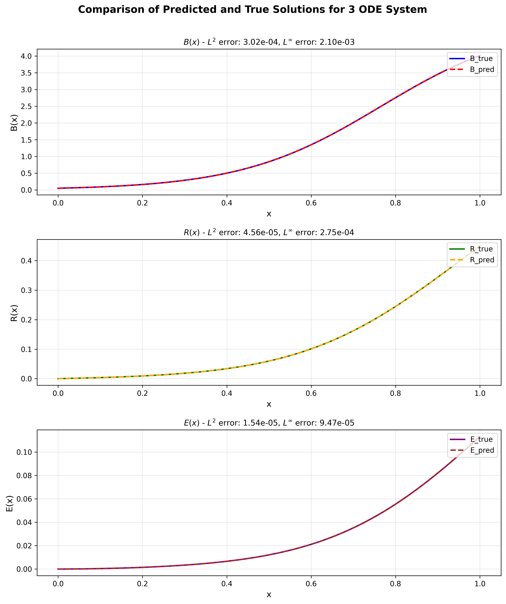
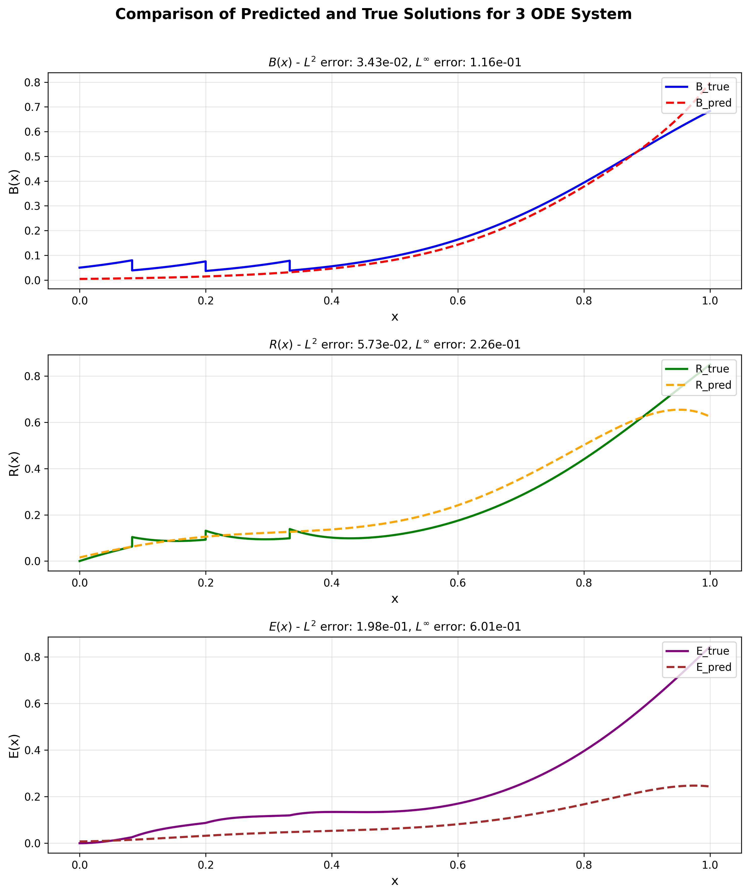

# PINN 訓練方法比較
## 純 ODE 約束 vs. ODE + 數據約束

EBV (Epstein-Barr Virus) 模型的兩種訓練策略

---

# 結果比較

<style scoped>
  section {
    display: flex;
    flex-direction: column;
    justify-content: center;
  }
  .comparison-container {
    display: grid;
    grid-template-columns: 1fr 1fr;
    gap: 30px;
    align-items: start;
  }
  .comparison-item {
    display: flex;
    flex-direction: column;
  }
  .comparison-item h2 {
    font-size: 24px;
    text-align: center;
    margin-bottom: 10px;
  }
  .comparison-item img {
    width: 100%;
    height: auto;
  }
  .comparison-item ul {
    font-size: 18px;
    margin-top: 10px;
  }
</style>

<div class="comparison-container">

<div class="comparison-item">

## 方法 1: 純 ODE 約束



- 僅使用物理方程式約束
- 與解析解比較

</div>

<div class="comparison-item">

## 方法 2: ODE + 數據約束



- 物理方程式 + CSV 數據
- 與 MATLAB RK4 （有jump）數據比較

</div>

</div>

---

# 數據來源說明

## evb_training_data.csv 數據來源

### MATLAB RK4 (Runge-Kutta 4th order) 數值解

```matlab
% 微分方程系統
B' = r*B*(1 - B/K)        % 腫瘤細胞成長 (Logistic model)
R' = sigma0*B - k12*R     % 放射誘導蛋白質產生
E' = k12*R - kc*E         % 效應蛋白質活化
```

- **數值方法**: 4階 Runge-Kutta (RK4)
- **時間範圍**: t ∈ [0, 60]
- **步長**: h = 0.1
- **輸出**: 時間序列數據 (t, B, R, E)

📝 **此數據被視為「高精度數值解」，用於訓練第二個 PINN 模型**

---

# 模型架構比較

## 共同架構設定

| 參數 | 設定值 |
|------|--------|
| 網絡類型 | Fully Connected Neural Network |
| 隱藏層數 | 6 層 |
| 每層神經元數 | 512 |
| 優化器 | Adam |
| 學習率調度 | TF Exponential (decay_rate=0.95) |
| 訓練步數 | 10,000 |
| 輸入 | x ∈ [0, 1] (縮放時間) |
| 輸出 | B(x), R(x), E(x) |

---

# 物理參數設定

## 統一物理參數

| 參數 | 符號 | 數值 | 說明 |
|------|------|------|------|
| 成長率 | r | 0.10 | 腫瘤細胞成長速率 |
| 承載量 | K | 5.0 | 環境承載容量 |
| B→R 轉換率 | σ₀ | 0.01 | B 細胞轉成 R 蛋白速率 |
| R→E 轉換率 | k₁₂ | 0.05 | R 蛋白轉成 E 蛋白速率 |
| E 衰減率 | kc | 0.15 | E 蛋白衰減速率 |
| 初始條件 | B₀, R₀, E₀ | 0.05, 0.0, 0.0 | 初始狀態 |
| 時間範圍 | [t₀, tf] | [0, 60] | 原始時間尺度 |

---

# Batch Size 配置比較

## 採樣點數差異

| Constraint | 方法 1: 純 ODE | 方法 2: ODE + 數據 |
|------------|----------------|-------------------|
| **初始條件 (IC)** | 600 | 600 |
| **內部點 (Interior)** | 6,000 | 6,000 |
| └─ 前期 (x < 0.3) | 4,200 (70%) | 4,200 (70%) |
| └─ 後期 (x ≥ 0.3) | 1,800 (30%) | 1,800 (30%) |
| **數據點 (Data)** | ❌ 無 | ✅ **64 (新增)** |

💡 **關鍵差異**: 方法 2 額外使用 CSV 數據進行訓練

---

# 🔴 **核心差異: 反向傳播的 Loss 函數**

## 方法 1: 純 ODE 約束 (3 個 Loss 項)

$$\mathcal{L}_{\text{total}} = \mathcal{L}_{\text{IC}} + \mathcal{L}_{\text{ODE}}$$

**詳細組成:**

初始條件 Loss:
$$\mathcal{L}_{\text{IC}} = 100 \cdot |B(0) - B_0|^2 + 100 \cdot |R(0) - R_0|^2 + 100 \cdot |E(0) - E_0|^2$$

ODE 殘差 Loss:
$$\mathcal{L}_{\text{ODE}} = \sum_{x_i \in \Omega} \left[ \lambda_B \cdot r_B^2(x_i) + \lambda_R \cdot r_R^2(x_i) + \lambda_E \cdot r_E^2(x_i) \right]$$

**權重設定:**
- 初始條件: λ_IC = 100
- ODE 殘差: λ_B = 1.0, λ_R = 5.0, λ_E = 5.0

---

# 🔴 Loss 函數差異 (續)

## 方法 2: ODE + 數據約束 (4 個 Loss 項)

$$\mathcal{L}_{\text{total}} = \mathcal{L}_{\text{IC}} + \mathcal{L}_{\text{ODE}} + \mathcal{L}_{\text{Data}}$$

**⭐ 新增數據 Loss:**

$$\mathcal{L}_{\text{Data}} = \sum_{i=1}^{N_{\text{data}}} \left[ \lambda_{B} \cdot |B(x_i) - B_{\text{CSV}}(x_i)|^2 + \lambda_{R} \cdot |R(x_i) - R_{\text{CSV}}(x_i)|^2 + \lambda_{E} \cdot |E(x_i) - E_{\text{CSV}}(x_i)|^2 \right]$$

**權重設定:**
- 數據擬合: λ_B,data = 10.0, λ_R,data = 10.0, λ_E,data = 10.0

💡 **關鍵:** 數據約束參與梯度下降，引導網絡快速收斂

---

# ODE 殘差計算

## 相對殘差形式 (避免絕對值梯度問題)

**B 變數殘差:**
$$r_B = \frac{B'(x) - \text{time\_scale} \cdot r \cdot B \cdot (1 - B/K)}{\sqrt{B^2 + (\epsilon \cdot B_{\text{scale}})^2}}$$

**R 變數殘差:**
$$r_R = \frac{R'(x) - \text{time\_scale} \cdot (\sigma_0 \cdot B - k_{12} \cdot R)}{\sqrt{R^2 + (\epsilon \cdot R_{\text{scale}})^2 + R_{\text{scale}}^2}}$$

**E 變數殘差:**
$$r_E = \frac{E'(x) - \text{time\_scale} \cdot (k_{12} \cdot R - k_c \cdot E)}{\sqrt{E^2 + (\epsilon \cdot E_{\text{scale}})^2 + E_{\text{scale}}^2}}$$

---

# 反向傳播過程比較

## 方法 1: 純物理驅動

```python
# 梯度計算僅來自物理約束
∇θ L_total = ∇θ (L_IC + L_ODE)

# 特點：
# ✓ 不需要外部數據
# ✓ 完全依賴物理方程式
# ✗ 可能存在多個局部最優解
# ✗ 對初始化敏感
```

## 方法 2: 物理 + 數據驅動

```python
# 梯度計算包含數據擬合項
∇θ L_total = ∇θ (L_IC + L_ODE + L_Data)

# 特點：
# ✓ 數據引導網絡收斂方向
# ✓ 減少不確定性
# ✓ 提高數值精度
# ✗ 依賴外部數據質量
```

---

# 採樣策略比較

## 內部點採樣 (兩種方法相同)

**時間分段採樣** - 針對動態特性優化:

| 區域 | 條件 | 採樣比例 | 目的 |
|------|------|----------|------|
| 前期 | x < 0.3 | 70% (4200 點) | 捕捉快速變化 |
| 後期 | x ≥ 0.3 | 30% (1800 點) | 穩態行為 |

**為什麼偏重前期?**
- B, R, E 在初期變化最劇烈
- ODE 殘差在此階段最大
- 需要更多採樣點來準確捕捉動態

---

# Lambda 權重設定哲學

## 權重選擇的物理意義

| Loss 項 | λ 值 | 理由 |
|---------|------|------|
| IC (初始條件) | 100 | **必須嚴格滿足** - 物理系統起點 |
| ODE_B | 1.0 | B 變化最大，殘差天然較大 |
| ODE_R | 5.0 | R 變化較小，提高權重平衡 loss |
| ODE_E | 5.0 | E 變化最小，提高權重平衡 loss |
| Data_B/R/E | 10.0 | 引導收斂方向，但不過度約束 |

**設計原則:**
1. IC 權重最高 → 確保正確的起始狀態
2. 變數權重反比於其典型變化範圍 → 平衡不同變數的 loss 貢獻
3. 數據權重適中 → 既引導訓練，又保持物理一致性

---

# 訓練效率比較

## 收斂特性

| 特性 | 方法 1: 純 ODE | 方法 2: ODE + 數據 |
|------|----------------|-------------------|
| 訓練穩定性 | 中等 | 較高 ✓ |
| 收斂速度 | 較慢 | 較快 ✓ |
| 解的唯一性 | 可能多解 | 更唯一 ✓ |
| 初值敏感度 | 較高 | 較低 ✓ |
| 外推能力 | 依賴物理 | 有限 |
| 數據依賴 | 無 ✓ | 高 |

**結論:**
- **方法 1** 適合: 已知精確物理定律，無可靠數據
- **方法 2** 適合: 有高質量數據，希望快速準確收斂

---

# 梯度流分析

## 反向傳播的梯度來源

### 方法 1: 純 ODE
```
Input x → Network(θ) → [B, R, E]
                           ↓
                    ┌──────┴──────┐
                    ↓             ↓
            Compute B', R', E'   Check IC
                    ↓             ↓
            ODE Residuals    IC Residuals
                    ↓             ↓
                    └──────┬──────┘
                           ↓
                   L_total (3 項)
                           ↓
                    ∂L/∂θ (梯度)
```

---

# 梯度流分析 (續)

## 方法 2: ODE + 數據

```
Input x → Network(θ) → [B, R, E]
                           ↓
            ┌──────────────┼──────────────┐
            ↓              ↓              ↓
    Compute B',R',E'   Check IC   Compare with CSV
            ↓              ↓              ↓
    ODE Residuals   IC Residuals   Data Residuals
            ↓              ↓              ↓
            └──────────────┼──────────────┘
                           ↓
                   L_total (4 項) ← 多一個數據項!
                           ↓
                    ∂L/∂θ (梯度更豐富)
```

**關鍵:** 數據項提供額外的梯度信息，幫助網絡快速找到正確的解空間

---

# 時間縮放技術

## 為什麼需要時間縮放?

**原始時間**: t ∈ [0, 60]  
**縮放時間**: x ∈ [0, 1]

轉換公式:
$$x = \frac{t - t_0}{t_f - t_0}$$

導數轉換:
$$\frac{dB}{dx} = (t_f - t_0) \cdot \frac{dB}{dt}$$

**優點:**
- ✅ 網絡輸入歸一化 → 訓練更穩定
- ✅ 避免大小數值混合 → 減少數值誤差
- ✅ 梯度更均勻分布

---

# 相對殘差的重要性

## 為什麼使用相對殘差?

**問題:** B, R, E 的數量級差異大
- B ~ O(5)
- R ~ O(1)  
- E ~ O(0.3)

**解決方案:** 歸一化殘差

$$
r_i = \frac{\text{絕對殘差}}{\text{典型尺度}} = \frac{|f_i|}{\sqrt{y_i^2 + \text{scale}_i^2}}
$$

**效果:**
- ✅ 不同變數的 loss 貢獻平衡
- ✅ 避免大變數主導訓練
- ✅ 小變數也能被準確學習

---

# CSV 數據在訓練中的作用

## 數據約束 vs. 驗證器

### 兩種方法都有 CSV 數據，但用途不同:

| 用途 | 方法 1 | 方法 2 |
|------|--------|--------|
| **訓練約束** (參與梯度) | ❌ | ✅ 64 點/batch |
| **驗證器** (僅監控) | ✅ 10000 點 | ✅ 全部點 |

**方法 2 的創新:**
```python
# 數據被加入為訓練約束
data_constraint = PointwiseConstraint(
    dataset=DictPointwiseDataset(invar, outvar, lambda_weighting),
    batch_size=64,  # 每次迭代採樣 64 個數據點
)
domain.add_constraint(data_constraint, "data_constraint")
```

→ **每個訓練步驟都會計算數據擬合 loss 並反向傳播**

---

# 損失函數梯度推導

## 方法 1 的梯度

$$\frac{\partial \mathcal{L}_{\text{total}}}{\partial \theta} = \frac{\partial \mathcal{L}_{\text{IC}}}{\partial \theta} + \frac{\partial \mathcal{L}_{\text{ODE}}}{\partial \theta}$$

**梯度來源:** 初始條件誤差 + 微分方程殘差

---

## 方法 2 的梯度

$$\frac{\partial \mathcal{L}_{\text{total}}}{\partial \theta} = \frac{\partial \mathcal{L}_{\text{IC}}}{\partial \theta} + \frac{\partial \mathcal{L}_{\text{ODE}}}{\partial \theta} + \frac{\partial \mathcal{L}_{\text{Data}}}{\partial \theta}$$

**額外的數據梯度:**
$$\frac{\partial \mathcal{L}_{\text{Data}}}{\partial \theta} = \sum_{i} 2\lambda \cdot (NN_\theta(x_i) - y_{\text{CSV},i}) \cdot \frac{\partial NN_\theta(x_i)}{\partial \theta}$$

💡 **關鍵:** 數據梯度引導網絡朝正確解收斂

---

# 總結: 兩種方法的適用場景

## 方法 1: 純 ODE 約束

**適用情況:**
- ✅ 物理定律完全已知且精確
- ✅ 無可用觀測數據或數據不可信
- ✅ 需要物理一致性外推
- ✅ 研究物理系統的理論性質

**侷限:**
- ⚠️ 訓練可能不穩定
- ⚠️ 需要仔細調整超參數
- ⚠️ 收斂較慢

---

# 總結: 兩種方法的適用場景 (續)

## 方法 2: ODE + 數據約束

**適用情況:**
- ✅ 有高質量數值/實驗數據
- ✅ 希望快速準確收斂
- ✅ 數據範圍內的預測
- ✅ 物理模型 + 觀測數據融合

**侷限:**
- ⚠️ 依賴數據質量
- ⚠️ 外推能力受限
- ⚠️ 可能過度擬合數據

---

# 關鍵結論

## 🎯 反向傳播 Loss 的核心差異

1. **Loss 項數量**: 方法 1 (3 項) vs. 方法 2 (4 項)
2. **梯度來源**: 方法 2 額外包含數據擬合梯度
3. **訓練導向**: 
   - 方法 1: 物理定律驅動
   - 方法 2: 物理定律 + 數據雙重驅動

## 🔬 數據來源

- **evb_training_data.csv** 由 MATLAB RK4 數值方法生成
- 時間範圍 [0, 60]，步長 h = 0.1
- 提供高精度參考解用於訓練/驗證

---

# 附錄: 程式碼對比

## Loss 計算的關鍵差異

### 方法 1 (純 ODE):
```python
# 只有 ODE 和 IC 約束
IC = PointwiseBoundaryConstraint(...)
interior_early = PointwiseInteriorConstraint(...)  # ODE residual
interior_late = PointwiseInteriorConstraint(...)   # ODE residual
```

### 方法 2 (ODE + 數據):
```python
# 除了 ODE 和 IC，還有數據約束
IC = PointwiseBoundaryConstraint(...)
interior_early = PointwiseInteriorConstraint(...)
interior_late = PointwiseInteriorConstraint(...)
data_constraint = PointwiseConstraint(...)  # ← 新增! 參與訓練
```